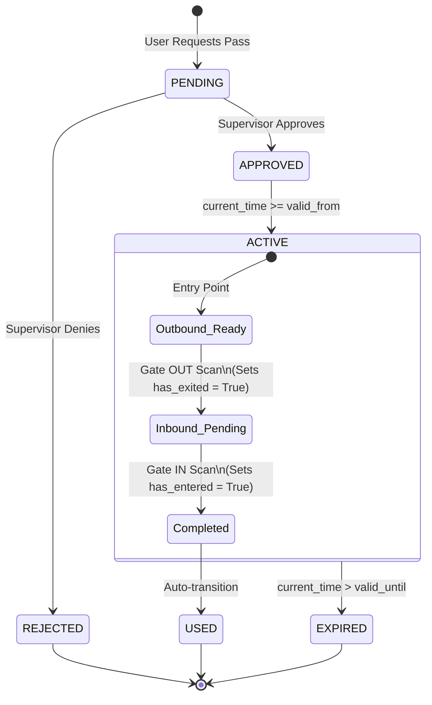

# Advanced Gatepass System: Architecture Blueprint & Workflow Specification

This document details the system design, relational database schema, state transitions, security handshakes, and cryptographic verification mechanisms for the **Advanced Gatepass System**. It is designed to meet the rigorous backend robustness, data integrity, and security standards expected of a campus access management solution.

---

## 1. Unified Relational Database Schema Architecture

The database layout uses a normalized relational design (conforming to 3NF) to enforce data integrity and strict referential constraints. To handle multiple user roles and distinct pass types without duplicating identity fields or creating a fragmented schema, we implement a **Table-per-Type (TPT) Inheritance Pattern** for users and polymorphically extend a unified `passes` table.

### 1.1 Identity & Access Management (RBAC)

To support students, faculty, conference guests, temporary single-day visitors, gate security, and various tiers of supervisors, we decouple core identity from role-specific profiles.

#### `roles` Table
Defines the authorization tiers in the system.
| Column | Type | Constraints | Description |
| :--- | :--- | :--- | :--- |
| `id` | `UUID` | `PRIMARY KEY`, default `gen_random_uuid()` | Unique role identifier |
| `name` | `VARCHAR(50)` | `UNIQUE`, `NOT NULL` | E.g., `STUDENT`, `FACULTY`, `SUPERINTENDENT`, `GATE_SECURITY`, etc. |
| `description` | `TEXT` | `NULL` | Explanation of role privileges |

#### `users` Table
The central identity store. All system actors possess a record here.
| Column | Type | Constraints | Description |
| :--- | :--- | :--- | :--- |
| `id` | `UUID` | `PRIMARY KEY`, default `gen_random_uuid()` | Unique user identifier |
| `role_id` | `UUID` | `FOREIGN KEY REFERENCES roles(id)`, `NOT NULL` | Associated RBAC role |
| `email` | `VARCHAR(255)` | `UNIQUE`, `NOT NULL` | User primary email address |
| `password_hash`| `VARCHAR(255)` | `NULL` | Argon2id hash (null for auto-provisioned/visitor accounts) |
| `full_name` | `VARCHAR(100)` | `NOT NULL` | Legal full name |
| `phone_number` | `VARCHAR(20)` | `UNIQUE`, `NOT NULL` | Unique contact number used for lookups/OTP |
| `swd_uid` | `VARCHAR(100)` | `UNIQUE`, `NULL` | External SWD identifier (for API mapping/auth) |
| `is_active` | `BOOLEAN` | `DEFAULT TRUE`, `NOT NULL` | Soft deactivation flag |
| `is_blacklisted` | `BOOLEAN` | `DEFAULT FALSE`, `NOT NULL` | Flag to block all system access instantly |
| `created_at` | `TIMESTAMP WITH TIME ZONE`| `DEFAULT CURRENT_TIMESTAMP`, `NOT NULL` | Record creation timestamp |
| `updated_at` | `TIMESTAMP WITH TIME ZONE`| `DEFAULT CURRENT_TIMESTAMP` | Last updated timestamp |

#### `hostels` Table
Stores hostel metadata for Student routing.
| Column | Type | Constraints | Description |
| :--- | :--- | :--- | :--- |
| `id` | `UUID` | `PRIMARY KEY`, default `gen_random_uuid()` | Unique hostel identifier |
| `name` | `VARCHAR(50)` | `UNIQUE`, `NOT NULL` | Name of the hostel (e.g., "Vyas Bhawan") |
| `superintendent_id` | `UUID` | `FOREIGN KEY REFERENCES users(id)`, `NOT NULL` | Assigned Hostel Superintendent |

#### `student_profiles` Table
Role-specific extension for Students, tracking residency, academic year, and category to apply fine-grained gate access rules.
| Column | Type | Constraints | Description |
| :--- | :--- | :--- | :--- |
| `user_id` | `UUID` | `PRIMARY KEY`, `FOREIGN KEY REFERENCES users(id) ON DELETE CASCADE` | References base user |
| `roll_number` | `VARCHAR(20)` | `UNIQUE`, `NOT NULL` | Campus Roll Number |
| `hostel_id` | `UUID` | `FOREIGN KEY REFERENCES hostels(id)`, `NULL` | Assigned hostel (null if Off-Campus) |
| `room_number` | `VARCHAR(10)` | `NULL` | Hostel room number (null if Off-Campus) |
| `student_category`| `VARCHAR(20)` | `DEFAULT 'UG'`, `NOT NULL` | E.g., `UG`, `PG`, `PHD` |
| `academic_year` | `INTEGER` | `DEFAULT 1`, `NOT NULL` | Academic year (1 through 4+) for tracking UG progression |
| `residency_status`| `VARCHAR(30)` | `DEFAULT 'ON_CAMPUS'`, `NOT NULL` | `ON_CAMPUS`, `OFF_CAMPUS_COMMUTER`, `LONG_TERM_AWAY` |
| `parent_phone` | `VARCHAR(20)` | `NOT NULL` | Contact for outpass escalation/approvals |

---

### 1.2 Multi-Tenant Pass Engine

A multi-tenant approach allows a single core `passes` table to manage the lifecycle, state transitions, and common attributes of all pass categories, while role-specific parameters are handled via secondary extensions.

#### `pass_batches` Table
Groups multi-tenant passes associated with a single event or conference.
| Column | Type | Constraints | Description |
| :--- | :--- | :--- | :--- |
| `id` | `UUID` | `PRIMARY KEY`, default `gen_random_uuid()` | Unique Batch identifier |
| `name` | `VARCHAR(100)` | `NOT NULL` | E.g., "National AI Conference 2026" |
| `host_user_id` | `UUID` | `FOREIGN KEY REFERENCES users(id)`, `NOT NULL` | Faculty sponsor initiating the batch |
| `status` | `VARCHAR(30)` | `DEFAULT 'PENDING'`, `NOT NULL` | `PENDING`, `APPROVED`, `REJECTED` |
| `created_at` | `TIMESTAMP WITH TIME ZONE`| `DEFAULT CURRENT_TIMESTAMP`, `NOT NULL` | Creation date |

#### `pass_types` Table
| Column | Type | Constraints | Description |
| :--- | :--- | :--- | :--- |
| `id` | `UUID` | `PRIMARY KEY` | Unique type ID |
| `name` | `VARCHAR(50)` | `UNIQUE`, `NOT NULL` | E.g., `OUTPASS`, `CONFERENCE_GUEST`, `FACULTY_VEHICLE`, `SINGLE_DAY_VISITOR`, `SEMESTER_LEAVE_PASS` |
| `requires_approval` | `BOOLEAN` | `DEFAULT TRUE`, `NOT NULL` | Flag bypassing approval for trusted passes |

#### `passes` Table
The main pass table representing the state machine. Each pass operates under a strict **Single Round-Trip Rule** (except for `SEMESTER_LEAVE_PASS` which acts as a permanent entry/re-entry token).
| Column | Type | Constraints | Description |
| :--- | :--- | :--- | :--- |
| `id` | `UUID` | `PRIMARY KEY`, default `gen_random_uuid()` | Unique pass identifier |
| `batch_id` | `UUID` | `FOREIGN KEY REFERENCES pass_batches(id) ON DELETE SET NULL` | Parent batch association for bulk passes |
| `pass_type_id` | `UUID` | `FOREIGN KEY REFERENCES pass_types(id)`, `NOT NULL` | Pass configuration |
| `requester_id` | `UUID` | `FOREIGN KEY REFERENCES users(id)`, `NOT NULL` | User who initiated/uses the pass |
| `status` | `VARCHAR(30)` | `NOT NULL` | `PENDING`, `APPROVED`, `REJECTED`, `ACTIVE`, `EXPIRED`, `USED` |
| `has_exited` | `BOOLEAN` | `DEFAULT FALSE`, `NOT NULL` | True if the user scanned `OUT` using this pass (N/A for Semester Passes) |
| `has_entered` | `BOOLEAN` | `DEFAULT FALSE`, `NOT NULL` | True if the user scanned `IN` using this pass (N/A for Semester Passes) |
| `valid_from` | `TIMESTAMP WITH TIME ZONE`| `NOT NULL` | Activation start time |
| `valid_until` | `TIMESTAMP WITH TIME ZONE`| `NOT NULL` | Hard expiration boundary |
| `purpose` | `TEXT` | `NOT NULL` | Reason for movement |
| `qr_secret_seed`| `VARCHAR(64)` | `NULL` | AES-256 encrypted seed (Null for SMS OTP verification passes) |
| `revoked_at` | `TIMESTAMP WITH TIME ZONE`| `NULL` | Timestamp when pass was manually revoked |
| `revoked_by` | `UUID` | `FOREIGN KEY REFERENCES users(id)`, `NULL` | Superintendent/Admin who revoked access |
| `created_at` | `TIMESTAMP WITH TIME ZONE`| `DEFAULT CURRENT_TIMESTAMP`, `NOT NULL` | Creation time |
| `updated_at` | `TIMESTAMP WITH TIME ZONE`| `DEFAULT CURRENT_TIMESTAMP` | Last updated time |

#### `pass_otps` Table
Stores one-time verification tokens sent via SMS to temporary guest accounts.
| Column | Type | Constraints | Description |
| :--- | :--- | :--- | :--- |
| `pass_id` | `UUID` | `PRIMARY KEY`, `FOREIGN KEY REFERENCES passes(id) ON DELETE CASCADE` | Child association |
| `otp_hash` | `VARCHAR(64)` | `NOT NULL` | SHA-256 hash of the 6-digit OTP |
| `expires_at` | `TIMESTAMP WITH TIME ZONE`| `NOT NULL` | Code expiration boundary |
| `verified_at` | `TIMESTAMP WITH TIME ZONE`| `NULL` | Timestamp of verification |

#### `pass_vehicles` Table
Appended metadata for vehicle passes (e.g., Faculty Vehicle RFID).
| Column | Type | Constraints | Description |
| :--- | :--- | :--- | :--- |
| `pass_id` | `UUID` | `PRIMARY KEY`, `FOREIGN KEY REFERENCES passes(id) ON DELETE CASCADE` | Primary reference to pass |
| `vehicle_number`| `VARCHAR(20)` | `NOT NULL` | E.g., `DL-3C-XX-1234` |
| `rfid_tag_id` | `VARCHAR(64)` | `UNIQUE`, `NOT NULL` | UID scanned from physical RFID sticker |
| `vehicle_model` | `VARCHAR(100)` | `NOT NULL` | Model and color details |

---

### 1.3 Approval Audits & Immutable Access Logs

#### `pass_approvals` Table
Audit trail of decisions.
| Column | Type | Constraints | Description |
| :--- | :--- | :--- | :--- |
| `id` | `UUID` | `PRIMARY KEY`, default `gen_random_uuid()` | Audit ID |
| `pass_id` | `UUID` | `FOREIGN KEY REFERENCES passes(id) ON DELETE CASCADE`, `NOT NULL` | Evaluated pass |
| `approver_id` | `UUID` | `FOREIGN KEY REFERENCES users(id)`, `NOT NULL` | Supervisor/Admin making decision |
| `decision` | `VARCHAR(20)` | `NOT NULL` | `APPROVED` or `REJECTED` |
| `comments` | `TEXT` | `NULL` | Reason for rejection or approval comments |
| `decided_at` | `TIMESTAMP WITH TIME ZONE`| `DEFAULT CURRENT_TIMESTAMP`, `NOT NULL` | Action timestamp |

#### `blacklisted_rfids` Table
Tracks lost, stolen, or security-revoked RFID tags.
| Column | Type | Constraints | Description |
| :--- | :--- | :--- | :--- |
| `rfid_tag_id` | `VARCHAR(64)` | `PRIMARY KEY` | Blacklisted tag |
| `reason` | `TEXT` | `NOT NULL` | E.g., "Reported Lost", "Faculty vehicle pass revoked" |
| `blacklisted_by`| `UUID` | `FOREIGN KEY REFERENCES users(id)`, `NOT NULL` | Security Officer/Admin ID |
| `created_at` | `TIMESTAMP WITH TIME ZONE`| `DEFAULT CURRENT_TIMESTAMP`, `NOT NULL` | Blacklist insertion time |

#### `gates` Table
Physical scanner points.
| Column | Type | Constraints | Description |
| :--- | :--- | :--- | :--- |
| `id` | `UUID` | `PRIMARY KEY` | Gate identifier |
| `name` | `VARCHAR(50)` | `UNIQUE`, `NOT NULL` | E.g., "Main Gate Entry", "Hostel 9 Exit" |
| `type` | `VARCHAR(20)` | `NOT NULL` | `PEDESTRIAN`, `VEHICLE`, `MIXED` |

#### `access_logs` Table (Immutable Ledger)
Records gate entries/exits. Must be write-once (enforced via database level triggers that block `UPDATE` and `DELETE` queries).
| Column | Type | Constraints | Description |
| :--- | :--- | :--- | :--- |
| `id` | `BIGSERIAL` | `PRIMARY KEY` | Auto-incrementing identifier |
| `pass_id` | `UUID` | `FOREIGN KEY REFERENCES passes(id)`, `NULL` | Associated pass (null if scanning raw tags) |
| `user_id` | `UUID` | `FOREIGN KEY REFERENCES users(id)`, `NULL` | Identified person |
| `rfid_tag_id` | `VARCHAR(64)` | `NULL` | RFID UID scanned (for vehicular logs) |
| `gate_id` | `UUID` | `FOREIGN KEY REFERENCES gates(id)`, `NOT NULL` | Scanner location |
| `direction` | `VARCHAR(10)` | `NOT NULL` | `IN` or `OUT` |
| `status` | `VARCHAR(20)` | `NOT NULL` | `GRANTED` or `DENIED` |
| `denial_reason` | `VARCHAR(255)` | `NULL` | E.g., `EXPIRED_PASS`, `UNAUTHORIZED_GATE`, `REENTRY_VIOLATION`, `RFID_BLACKLISTED` |
| `logged_at` | `TIMESTAMP WITH TIME ZONE`| `DEFAULT CURRENT_TIMESTAMP`, `NOT NULL` | Scanned time |

---

## 2. Request-Approval Matrix & Workflow States

### 2.1 Workflow State Machine Diagram (Single Round-Trip Verification)



To enforce the **Single Entry/Exit (Round-Trip) Constraint**, the database applies these checks during access evaluation:
- **Outbound scan (`OUT`)**: Permitted if `status = ACTIVE` and `has_exited = FALSE`. On success, `has_exited` is marked `TRUE`.
- **Inbound scan (`IN`)**: Permitted if `status = ACTIVE`, `has_exited = TRUE`, and `has_entered = FALSE`. On success, `has_entered` is marked `TRUE` and `status` is automatically updated to `USED`.
- **Violations**: Scanning `OUT` when `has_exited = TRUE` or scanning `IN` when `has_entered = TRUE` triggers an immediate log entry into `access_logs` with status `DENIED` and `denial_reason = REENTRY_VIOLATION`.

#### 2.1.1 Strict Sequential Trip Constraint
To prevent students from holding multiple active trips concurrently (e.g., requesting a new pass while already outside the campus to extend their stay indefinitely), the pass application service enforces a strict check during pass requests.

*   **Rule**: When a student requests a new pass (`POST /api/v1/passes/request`), the system queries the `passes` table for the student's `requester_id`.
*   **Blocking Condition**: If a record exists where `has_exited = TRUE` AND `has_entered = FALSE` (indicating the user is currently off-campus and has not closed their last trip), the pass generation transaction fails.
*   **Application Action**: Aborts transaction and raises a `409 Conflict` exception to block request completion.

---

### 2.2 Routing Logic & Hierarchical Handshake

When a request is generated, routing must happen dynamically without hardcoding supervisor names. The resolving flow is as follows:

```
[Student Outpass Request]
          │
          ▼
Get Student Profile ──────► Get Hostel ID ──────► Get Hostel Record 
                                                         │
                                                         ▼
                                            Get Superintendent ID
                                                         │
                                                         ▼
                                            Route to Pending Queue
```

#### Student Outpass Request Routing:
1. **Submission**: The Student requests an outpass through the API.
2. **Context Resolution**: The application fetches the student's `student_profiles` record matching their `user_id`.
3. **Hierarchy Traversal**:
   - The query extracts the `hostel_id`.
   - It references the `hostels` table to extract the `superintendent_id` mapped to that hostel.
4. **Queue Insertion**: A new record is created in the `passes` table with a state of `PENDING`. An entry in the `pass_approvals` target queue routes notifications to the determined `superintendent_id`.
5. **Fallbacks**: If a hostel lacks an active superintendent, the system cascades the request to the `Admin` user pool.

---

### 2.3 External SWD App API Integration & Auto-Provisioning

To prevent student credentials from being compromised if the Gatepass database is accessed, we implement **Asymmetric JWT Verification using JWKS**.

```
+---------------+                    +-----------------+                    +------------------+
|    Client     |                    |  Gatepass API   |                    |   SWD Identity   |
+-------+-------+                    +--------+--------+                    +--------+---------+
        |                                     |                                      |
        |-----(1) Auth Req with Creds-------->|                                      |
        |<----(2) Return Signed JWT-----------|                                      |
        |                                     |                                      |
        |-----(3) API request with Bearer JWT>|                                      |
        |                                     |-----(4) Fetch JWKS Public Keys------>|
        |                                     |<----(5) Return JWKS Json-------------|
        |                                     |                                      |
        |                                     |--[Verify Signature & Claims]         |
        |                                     |--[Safe Transaction / Provision]      |
        |<----(6) Access Token / Data---------|                                      |
```

#### Asymmetric Verification Handshake
1. **JWKS Fetching & Caching**: 
   - The Gatepass API does not store any passwords or secret symmetric keys.
   - It communicates with the SWD identity server’s JWKS endpoint to fetch the active public keys (RS256).
   - Public keys are cached locally in Redis with a 24-hour Time-to-Live (TTL) to avoid blocking verification. If a JWT header specifies a Key ID (`kid`) not in the cache, the API performs a cache-miss query to SWD.
2. **Signature Verification**:
   - The Gatepass API extracts the token signature and verifies it using the public key corresponding to the token's `kid`.
   - Even if our database is fully compromised, attackers cannot forge access tokens because they do not have access to the SWD private key.
3. **Claims Validation**: The API verifies `iss` (must match SWD issuer string), `aud` (must match Gatepass Client ID), and `exp`.

---

## 3. Innovative Verification Mechanics

### 3.1 Time-Expiring Dynamic/Rotating QRs (HMAC-SHA256 Tokenization)

To prevent screenshot sharing, the QR code does not contain static text or plain pass IDs. Instead, it embeds a dynamic token generated using a Time-Based One-Time Password (TOTP) derivative that updates every **15 seconds**.

#### Token Generation Logic
When a pass is approved, the system generates a secure 32-byte seed `qr_secret_seed`, encrypts it at rest, and shares it only with the authorized user's app.

The token generated on the user's mobile screen is structured as:
```
Token = Base64UrlSafe(Pass_ID) + "." + Base64UrlSafe(Timestamp) + "." + Verification_Hash
```
Where the `Verification_Hash` is computed as:
$$Verification\_Hash = HMAC\text{-}SHA256(Secret\_Seed, Pass\_ID \parallel Timestamp)$$
The `Timestamp` is the current Unix epoch divided by the step interval (15 seconds):
$$Timestamp = \lfloor \frac{Current\_Epoch}{15} \rfloor$$

#### Verification Protocol at the Gate
1. The security guard's app scans the QR and decodes the string.
2. It extracts `Pass_ID` and the creation `Timestamp`.
3. **Drift Check**: The server/guard app validates if the encoded timestamp matches the current step timestamp, allowing a drift factor of $\pm 1$ step (to account for clock skew on user devices). If:
   $$|Timestamp_{Current} - Timestamp_{QR}| > 1$$
   The code is immediately rejected as expired.
4. **Cryptographic Validation**: The system loads the decrypted `qr_secret_seed` for that `Pass_ID` and recalculates the `Verification_Hash`. If the computed hash matches the scanned hash, the QR is valid.
5. **State Assertion**: The system performs a final DB check to confirm the pass status is `ACTIVE` and that the pass entry/exit rules are satisfied (`has_exited` or `has_entered` assertions).

---

### 3.2 Simulated RFID Vehicle Scanning

RFID scanning must execute with low latency to avoid gridlock at vehicle barriers. To achieve sub-millisecond evaluation times, we implement a **Redis-backed cache lookup architecture**.

#### Cache Synchronization
When a vehicle pass is approved or status changes, a post-save hook updates Redis:
* **Key Structure**: `rfid:tag:<rfid_tag_id>`
* **Value Structure**: JSON serialization of pass status and validity boundaries.

#### Fast Gate-Side Pipeline (Logical Python API Flow)
1. **Request Reception**: RFID reader posts `{ "rfid_tag_id": "E280119120007804B32F", "gate_id": "11a2..." }` to `/api/v1/gate/rfid-scan`.
2. **Step 1: Cache Read**: The API checks Redis:
   ```python
   cached_pass = await redis.get(f"rfid:tag:{rfid_tag_id}")
   ```
3. **Step 2: Fallback Database Fetch**: If there is a cache miss, the system executes an optimized database join query:
   ```sql
   SELECT p.id, p.status, p.valid_from, p.valid_until, pv.vehicle_number, p.requester_id
   FROM pass_vehicles pv
   JOIN passes p ON pv.pass_id = p.id
   WHERE pv.rfid_tag_id = :rfid_tag_id LIMIT 1;
   ```
   If found, the system asynchronously populates Redis with a TTL matching the `valid_until` boundary.
4. **Step 3: Business Logic Evaluation**:
   - Check status == `ACTIVE`.
   - Verify `current_timestamp` falls between `valid_from` and `valid_until`.
5. **Step 4: Asynchronous Logging & Barrier Command**:
   - The API immediately responds to the gate controller:
     ```json
     { "status": "ALLOW", "vehicle": "DL-3C-XX-1234", "owner": "Dr. Smith" }
     ```
   - In the background, the application uses FastAPI's `BackgroundTasks` to insert the audit trail record into `access_logs`. This isolates gate responsiveness from database write performance.

---

## 4. Hybrid Graceful Degradation Strategy (RFID Gate Autonomy)

To maintain operations during campus network outages (e.g., server downtime, routing drops), physical gate controllers run an autonomous local agent connected to a localized database engine.

### 4.1 Priority Edge Caching (Local SQLite)

Each gate controller contains an embedded **SQLite** database that replicates active passes. However, to stay within resource limits and maintain high security, the gate controller uses a **segmented caching strategy**:

1. **Resident Cache Segment (High Priority)**:
   - Includes RFID data for all Permanent Residents (Faculty and Staff).
   - Synchronized daily during low-traffic windows (e.g., 03:00 AM) and updated via incremental push notifications (over WebSockets or MQTT) when new vehicle passes are created.
   - Values are stored locally without expiration timelines (except the pass expiration date itself).
2. **Temporary Guest Cache Segment (Low Priority)**:
   - Guest outpasses are **never** synced to the local SQLite database.
   - When the system goes offline, guests/single-day visitors cannot bypass the gate automatically. Guests must be manually verified by guards, who use a physical register to log entry/exit.

---

### 4.2 Conflict Resolution & Offline Anti-Passback (APB) Logic

"Anti-Passback" (APB) prevents a user from scanning their RFID tag to enter, and then passing the card back to another driver to enter on the same pass. When the network is offline, gates must prevent card reuse while only possessing local state data.

#### Offline APB State Tracking
The local SQLite database maintains a tracking table:
```sql
CREATE TABLE local_apb_states (
    rfid_tag_id TEXT PRIMARY KEY,
    last_known_direction TEXT CHECK(last_known_direction IN ('IN', 'OUT')),
    last_scan_timestamp INTEGER,
    offline_override_count INTEGER DEFAULT 0
);
```

#### Verification Protocol (Offline Execution)
1. **Physical Tag Scan**: RFID tag `T_1` is scanned at the Gate.
2. **Locate Resident Profile**: Query local SQLite database. If the record does not exist or has expired, access is **Denied** (Gate remains closed).
3. **Validate APB State**:
   - Query `local_apb_states` for `T_1`.
   - If a record is found:
     - If the gate direction is `OUT` and `last_known_direction` is `OUT`, access is **Denied** (APB Violation - trying to leave campus twice without entering).
     - If the gate direction is `IN` and `last_known_direction` is `IN`, access is **Denied** (APB Violation - trying to enter campus twice without leaving).
     - If the direction is different (e.g. current = `IN`, last = `OUT`), access is **Granted**.
   - If no local record is found, the system assumes the last transition was successful and creates a temporary APB tracking record.
4. **Update APB State**: Set `last_known_direction` to current direction, update `last_scan_timestamp` to local hardware time, and increment `offline_override_count`.

---

### 4.3 The Audit Sync & Reconciliation Protocol

While offline, all accesses (allowances and rejections) are saved to a local transaction log table to ensure we have a complete audit history.

#### Local SQLite Transaction Table
```sql
CREATE TABLE offline_transaction_log (
    sync_id TEXT PRIMARY KEY,          -- UUID generated on the edge
    rfid_tag_id TEXT NOT NULL,
    direction TEXT NOT NULL,
    status TEXT NOT NULL,
    denial_reason TEXT,
    logged_at INTEGER NOT NULL,        -- Unix epoch of event
    hash_chain TEXT NOT NULL           -- Prevents log tampering on the edge controller
);
```

#### Hash Chain Verification
To guarantee the integrity of offline logs, each entry calculates a cryptographic hash chain:
$$Hash_{N} = SHA256(Hash_{N-1} \parallel Sync\_ID \parallel RFID\_Tag \parallel Direction \parallel Status \parallel Logged\_At)$$
This prevents unauthorized users from altering gate access history stored locally on the physical controllers.

#### Reconciliation Engine Flow (Central Server Sync)
When connectivity is restored, the edge controller initiates a synchronization protocol with the central API:
1. **Push & Validate**: The edge controller logs in and sends its pending log entries. The Central API validates the edge device's certificate and verifies the log's cryptographic hash chain.
2. **Idempotent Insertion**:
   - The central database processes sync records using the edge-generated `sync_id` as an idempotency key.
   - If a connection dropped during a previous sync, duplicate transactions are safely ignored (`ON CONFLICT DO NOTHING`).
3. **State Reconciliation & Alerting**:
   - If the offline log records a user entering (`IN`) but the central server's database shows they already scanned `IN` elsewhere (e.g., at another gate that remained online), a **Passback Conflict Exception** is raised.
   - The system flags the pass status as `COMPROMISED` and records the conflict in the permanent database access log with a warning tag. This alerts security supervisors to investigate card sharing or cloning.

---

### 4.4 Tiered Security and Convenience Trade-offs

This hybrid design balances convenience and security depending on the user's role:

| Security Dimension | Permanent Residents (Faculty/Staff) | Temporary Guests (Participants/Visitors) |
| :--- | :--- | :--- |
| **Outage Experience** | **Seamless (Zero Latency)**: Local SQLite cache allows automated entry and exit scans. | **Manual Process**: RFID/QR reader denies access. Guard must manually verify credentials and log access. |
| **Security Verification** | **Cached Profiles**: Edge verification checks pre-validated, locally stored RFID associations. | **Real-Time Validation Required**: Relies on dynamic cryptographic QR verification, which requires server access. |
| **Abuse Mitigation** | **Offline Anti-Passback**: Local tracking state prevents card passback during downtime. | **Strict Lockout**: Prevents unauthorized access attempts using expired or screenshotted visitor QRs. |
| **System Impact** | High traffic volume of regular residents continues without bottlenecks. | Low-volume visitor check-in degrades gracefully to manual checkpoints. |

---

## 5. Guest SMS Verification Workflow (The "Non-Tech" Solution)

To accommodate temporary single-day visitors who do not have access to the mobile application or lack internet connectivity on campus, the system supports a fallback verification model utilizing SMS-driven OTPs.

### 5.1 System Workflow
1. **Pass Creation**: A resident student or faculty member submits a pass request for a visitor. They select the `SINGLE_DAY_VISITOR` pass type and enter the guest's mobile phone number.
2. **OTP Generation**:
   - The backend creates a record in the `passes` table.
   - Simultaneously, a cryptographically secure 6-digit random code is generated.
   - The SHA-256 hash of this code is stored in the `pass_otps` table linked to the `passes` record, with an expiration time set to match the pass validity or a maximum of 4 hours.
   - The plain code is transmitted to the visitor’s mobile number via an SMS gateway API integration.
3. **Gate Verification**:
   - The guest arrives at the gate and provides their phone number and the 6-digit OTP.
   - The security guard enters this data into the Guard Dashboard UI.
   - The API evaluates the payload using the validation routine:
     ```sql
     SELECT p.id, po.otp_hash, po.expires_at, p.status
     FROM passes p
     JOIN users u ON p.requester_id = u.id
     JOIN pass_otps po ON po.pass_id = p.id
     WHERE u.phone_number = :phone_number
       AND p.status = 'ACTIVE'
       AND po.verified_at IS NULL
       AND po.expires_at > CURRENT_TIMESTAMP;
     ```
   - If a record is found, the system hashes the entered OTP using SHA-256 and compares it.
   - If they match, the system updates `pass_otps.verified_at = CURRENT_TIMESTAMP`, sets the pass's `has_exited` (or `has_entered`) column to `TRUE`, and opens the gate barrier.

---

## 6. Bulk Pass Issuance & Batch Approval Flow

For campus events (conferences, workshops), processing individual requests is inefficient. The system implements a bulk creation framework grouping multiple sub-passes under a single authorization unit.

### 6.1 Logical Model & CSV Upload Handler
1. **Bulk Ingestion API**: A Faculty member uploads a list containing participant details (Name, Email, Phone, Organization, ID Type, ID Hash).
2. **Transaction Scope**: The upload handler executes inside a transactional unit:
   - A single `pass_batches` record is created with `status = 'PENDING'`.
   - For each row in the CSV:
     - The system checks if a user with that phone number/email exists; if not, it auto-provisions a `users` record with role `CONFERENCE_GUEST`.
     - An associated `visitor_profiles` row is created.
     - A sub-pass is generated in the `passes` table:
       ```sql
       INSERT INTO passes (batch_id, pass_type_id, requester_id, status, valid_from, valid_until, purpose, qr_secret_seed)
       VALUES (:batch_id, :conf_pass_type_id, :new_user_id, 'PENDING', :start_date, :end_date, :event_name, :encrypted_seed);
       ```
3. **Recursive Batch Approval**:
   - The batch is routed to the designated supervisor (e.g. Conference Supervisor or Admin).
   - The supervisor evaluates the event details and updates the status of the `pass_batches` record to `APPROVED`.
   - The database updates all children records recursively:
     ```sql
     UPDATE passes
     SET status = 'APPROVED'
     WHERE batch_id = :batch_id AND status = 'PENDING';
     ```
     This triggers asynchronous events to dispatch access tokens / seeds to all participants.

---

## 7. Real-Time Revocation & Blacklist Engine

To maintain physical security, lost credentials or revoked permissions must propagate to all gates within seconds to prevent unauthorized entry.

### 7.1 Cache Invalidation & Gate Propagation Protocol

The backend uses a **Publish-Subscribe (Pub/Sub) pattern** over Redis to propagate changes instantly, ensuring gates block access even if they are in the process of transitioning offline.

#### Revocation Workflows
- **Pass Revocation**: When a pass is cancelled (e.g., guest evicted, outpass revoked):
  - The API updates the record:
    ```sql
    UPDATE passes 
    SET status = 'EXPIRED', revoked_at = CURRENT_TIMESTAMP, revoked_by = :staff_id
    WHERE id = :pass_id;
    ```
  - The system checks if this pass is mapped to any RFID tags in `pass_vehicles`. If so, it invalidates the Redis cache key: `DEL rfid:tag:<rfid_tag_id>`.
- **RFID Blacklisting**: When an RFID tag is reported lost/stolen:
  - The security guard registers the loss, adding the tag to the `blacklisted_rfids` table.
  - The system removes the tag from the active Redis cache and adds it to a global blacklisted cache set: `SADD rfid:blacklist <rfid_tag_id>`.

#### Real-time Push Protocol
1. After removing keys from Redis and updating SQL, the server publishes a message to the channel `gate_sync`:
   ```json
   {
     "event": "REVOCATION",
     "rfid_tag_id": "E280119120...",
     "pass_id": "4a7b-3b8c...",
     "timestamp": 1780723205
   }
   ```
2. The gate controllers running the local edge service listen to this Redis Pub/Sub channel (or MQTT topic when operating over WAN).
3. Upon receiving the message, the edge agent immediately executes a delete query against its local SQLite database:
   ```sql
   DELETE FROM local_apb_states WHERE rfid_tag_id = :rfid_tag_id;
   ```
   If a guard scans the blacklisted RFID tag, the local database query returns empty, denying entry immediately.

---

## 8. Resident & Day-Scholar Lifecycle Access Rules

To support varying student categories (UG, PG, PhD) and their corresponding residency tiers, the Gatepass validation engine executes dynamic rules during scans.

### 8.1 Student Tiers and Residency States
1. **Undergraduate (UG) Students (Years 1-3)**:
   - Always flagged as `ON_CAMPUS` residents by default.
   - Bound by standard daily outpass check-in/check-out approvals from their designated Hostel Superintendents, subject to late-night hostel curfews.
2. **Undergraduate (UG) Students (4th Year)**:
   - Operates under a **Dual-Status Lifecycle**:
     - *Semester A (On-Campus)*: Standard outpass regulations (`residency_status = 'ON_CAMPUS'`).
     - *Semester B (Practice School/Internships)*: Assigned `residency_status = 'LONG_TERM_AWAY'`. They do not reside in hostels but require frequent campus re-entry for academic/administrative tasks without requesting manual daily outpasses. Bypasses hostel curfews.
3. **PhD Students**:
   - *On-Campus Residents*: Bind to default residency rules (`residency_status = 'ON_CAMPUS'`).
   - *Day Scholars*: Flagged with permanent commuter access (`residency_status = 'OFF_CAMPUS_COMMUTER'`) allowing automatic daily entry/exit checks for themselves and registered vehicles during authorized hours.

---

### 8.2 The "Single Gate" Verification Flow

The Main Gate verification process evaluates student details and active passes dynamically.

```
                  [ RFID or QR Scanned at Main Gate ]
                                  │
                                  ▼
                    Check if Tag/User is Blacklisted
                                  │
                    ┌─────────────┴─────────────┐
               (Yes)│                           │(No)
                    ▼                           ▼
              [DENY ACCESS]           Check Residency Status
                                                │
         ┌────────────────────────┬─────────────┴────────────┬────────────────────────┐
         │                        │                          │                        │
         ▼                        ▼                          ▼                        ▼
  [ FACULTY/STAFF ]      [ OFF_CAMPUS_COMMUTER ]      [ LONG_TERM_AWAY ]        [ ON_CAMPUS ]
         │                        │                          │                        │
  [ALLOW ACCESS]            Is scan time               Is valid, active          Is active, approved
   (Always Allowed)       between 06:00-23:59?       SEMESTER_LEAVE_PASS?        outpass found in time
                                  │                          │                   window? (Single use)
                             ┌────┴────┐                ┌────┴────┐                   │
                        (Yes)│     (No)            (Yes)│     (No)               ┌────┴────┐
                             ▼         ▼                ▼         ▼         (Yes)│     (No)
                          [ALLOW]   [DENY]           [ALLOW]   [DENY]            ▼         ▼
                                                                              [ALLOW]   [DENY]
```

---

### 8.3 Single-Gate SQL Validation Execution

```sql
-- Comprehensive SQL logic executed in the gate scan pipeline
WITH scan_context AS (
    SELECT 
        u.id AS user_id,
        u.is_blacklisted,
        r.name AS role_name,
        sp.student_category,
        sp.residency_status,
        sp.academic_year
    FROM users u
    JOIN roles r ON u.role_id = r.id
    LEFT JOIN student_profiles sp ON u.id = sp.user_id
    -- Matches scanned vehicle RFID or user ID
    WHERE u.id = :scanned_user_id 
       OR u.id = (SELECT requester_id FROM passes p JOIN pass_vehicles pv ON pv.pass_id = p.id WHERE pv.rfid_tag_id = :scanned_rfid_id LIMIT 1)
)
SELECT 
    sc.*,
    p.id AS pass_id,
    pt.name AS pass_type,
    p.status AS pass_status,
    p.has_exited,
    p.has_entered
FROM scan_context sc
LEFT JOIN passes p ON p.requester_id = sc.user_id 
    AND p.status = 'ACTIVE'
    AND CURRENT_TIMESTAMP BETWEEN p.valid_from AND p.valid_until
LEFT JOIN pass_types pt ON p.pass_type_id = pt.id
LIMIT 1;
```

#### Logical Processing Rules
1. **Blacklist Exception**: If `is_blacklisted = TRUE`, deny access immediately (`status = DENIED`, `reason = USER_BLACKLISTED`).
2. **Faculty Rule**: If `role_name = 'FACULTY'`, allow access immediately.
3. **Commuter Rule (`OFF_CAMPUS_COMMUTER`)**:
   - If `residency_status = 'OFF_CAMPUS_COMMUTER'` (PhD Day Scholars):
     - If the scan occurs during standard commuter hours (**06:00 to 23:59**), allow access.
     - If outside these hours, deny access unless a manual supervisor override is registered.
4. **Long-Term Away Rule (`LONG_TERM_AWAY`)**:
   - If `residency_status = 'LONG_TERM_AWAY'` (4th Year Off-Campus UG):
     - Validate that there is an active pass of type `SEMESTER_LEAVE_PASS` returned from the query.
     - If found and active, allow access. (The single-use round-trip limit is bypassed for this pass category).
5. **Resident Rule (`ON_CAMPUS`)**:
   - If `residency_status = 'ON_CAMPUS'` (UG/PG Residents, On-Campus PhDs):
     - Look for an active `OUTPASS` or `SINGLE_DAY_VISITOR` pass.
     - Apply the **Single Round-Trip Rule**:
       - If scan is `OUT`: Deny if `has_exited = TRUE`. If `FALSE`, grant access and update `has_exited = TRUE`.
       - If scan is `IN`: Deny if `has_entered = TRUE`. If `has_exited = TRUE` and `has_entered = FALSE`, grant access, update `has_entered = TRUE` and transit status to `USED`.

---

### 8.4 "Status Flip" Transition Workflow

When a 4th-year student transitions from an On-Campus Resident (Semester 1) to an Off-Campus student on Practice School / Internship (Semester 2), the system executes an automated batch status migration.

```
[ Academic Registry CSV Upload ] ──► [ DB Transaction Start ]
                                               │
                                               ├─► Bulk Update student_profiles:
                                               │   - residency_status = 'LONG_TERM_AWAY'
                                               │   - hostel_id = NULL, room_number = NULL
                                               │
                                               ├─► Bulk Insert passes:
                                               │   - pass_type_id = SEMESTER_LEAVE_PASS
                                               │   - valid_from = Sem Start, valid_until = Sem End
                                               │   - status = 'ACTIVE'
                                               │
                                               ├─► Cache invalidation trigger (Redis / SQLite update)
                                               │
                                               ▼
                                   [ Batch Status Flip Complete ]
```

#### Execution Checklist
1. **Bulk Upload Ingestion**: The Academic division uploads a registration CSV mapping student roll numbers to their Semester 2 statuses:
   ```csv
   roll_number,residency_status,academic_year,semester_start,semester_end
   ```
2. **Transactional Database Migration**:
   - The backend runs a PostgreSQL transaction at `Read Committed` isolation level.
   - For each student:
     - Updates `student_profiles` setting `residency_status = 'LONG_TERM_AWAY'`, `hostel_id = NULL`, and `room_number = NULL`.
     - Invalidate any standard outpasses pending in the queue:
       ```sql
       UPDATE passes SET status = 'EXPIRED' WHERE requester_id = :user_id AND status = 'PENDING';
       ```
     - Inserts a new row in the `passes` table:
       ```sql
       INSERT INTO passes (pass_type_id, requester_id, status, valid_from, valid_until, purpose)
       VALUES (
           (SELECT id FROM pass_types WHERE name = 'SEMESTER_LEAVE_PASS'),
           :user_id,
           'ACTIVE',
           :semester_start,
           :semester_end,
           '4th Year Practice School Off-Campus Access'
       );
       ```
3. **Synchronized Invalidation Broadcast**:
   - Invalidates the Redis lookup keys for the modified users.
   - Pushes an update event over the WebSocket/MQTT sync topic (`gate_sync`). Gate agents receive this update and synchronize their local SQLite database caches, moving the student profiles to the local high-priority cache since `LONG_TERM_AWAY` students require offline-capable entry validation.
